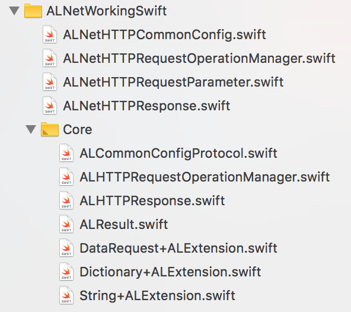

# ALNetWorkingSwift

**ALNetWorkingSwift** 主要提供给公司内部的Swift项目。到目前为止，已经集成了与网络请求相关的操作，包括数据映射模块。

## 例子项目

要运行示例项目，需要先克隆repo，并首先从示例目录运行 `pod install`。

## 环境要求

- iOS 8.0+
- Xcode 9.3+
- Swift 4.1+

## 安装

**ALNetWorkingSwift** 的源代码已经放在 [CocoaPods](https://cocoapods.org)。安装只需将以下行添加到您的 *Podfile* 文件中即可：

```ruby
platform :ios, '8.0'
use_frameworks!

target '<Your Target Name>' do
    pod 'ALNetWorkingSwift'
    # 您也可以只加载 Core 模块，在主项目中定制满足业务的网络请求:
    # pod 'ALNetWorkingSwift/Core'
end
```

然后，运行以下命令：

```ruby
$ pod install
```

## 文件目录



目前，Core 文件夹里面的文件都是 Core 模块文件，可单独运行。以外的文件，就是跟业务相关的再次封装。**主项目**可参照，依赖 **Core 模块**进行再次封装。

## 核心模块基本使用

### 网络请求
您可以调用该方法来初始化一个通用的网络请求:
```swift
ALHTTPRequestOperationManager.default.requestBase(httpMethod: .get, url: "https://www.baidu.com", urlEncoding: TURLEncoding.default, parameter: nil) { (response) in        
    switch response.result {
    case .success(let res):
        print(res)
    case .failure(let err):
        print(err)
    }
}
```

您也可以调用以下方法来上传数据:

```swift
ALHTTPRequestOperationManager.default.uploadBase(url: "https://www.baidu.com", multipartFormData: { (formData) in
    // The assembly to upload data
}) { (result) in
    switch result {
    case .success(let request, let streamingFromDisk, let streamFileURL):
        print(request)
        print(streamingFromDisk)
        print(streamFileURL ?? "")
    case .failure(let err):
        print(err)
    }
}
```

此处返回的成功或失败的判定是相对于服务器而言的，而不是业务相关的状态码。也就是说网络请求收到的*不合法*的数据或者服务器异常的情况，会判定失败。

### 高级用法
您还可以重新封装这两种方法以满足业务需求。

#### 协议配置
为了符合 `ALCommonConfigProtocol`，结构体需要实现一些属性和方法：

```swift
public struct HTTPConfig: ALCommonConfigProtocol {
    
    public var kHttpUserAgent: String = ""
    
    init() {
        
    }
    
    public func getHeader(dictHeader: [String: String]? = nil) -> [String: String] {
        var header: [String:String] = [String: String]()
        if dictHeader != nil {
            header.merge(dictHeader!) { (_, new) in new }
        }
        return header
    }
    
    public func getContentType(contentType: Set<String>? = nil) -> Set<String> {
        var content: Set<String> = Set<String>()
        contentType?.forEach({ (ele) in
            content.insert(ele)
        })
        return content
    }
}
```

然后,调用这个方法：

```swift
ALHTTPRequestOperationManager.default.httpConfig = HTTPConfig()
```


## 作者

Anyeler, 414116969@qq.com

## 许可证

ALNetWorkingSwift is available under the MIT license. See the LICENSE file for more info.
